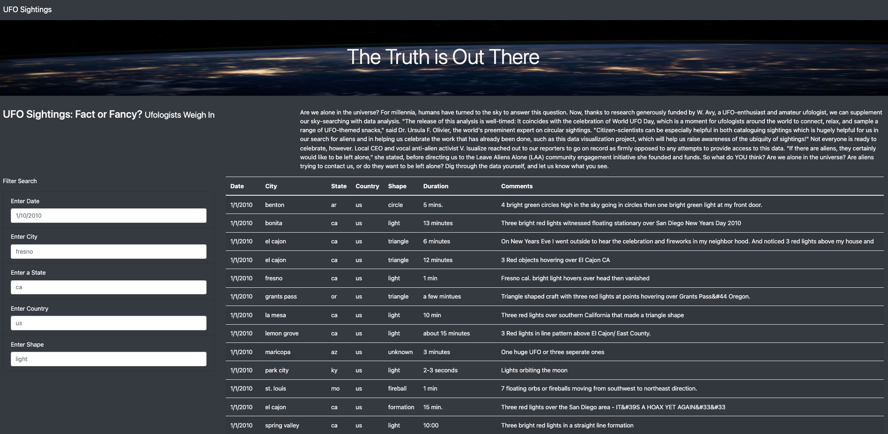
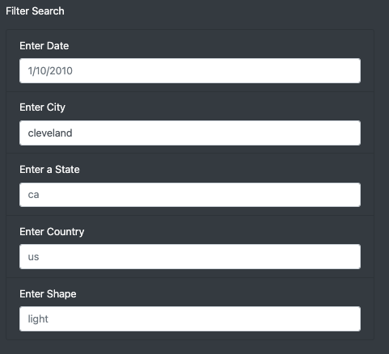
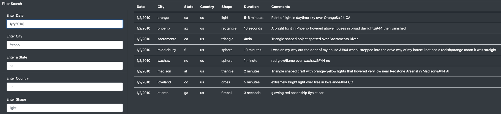
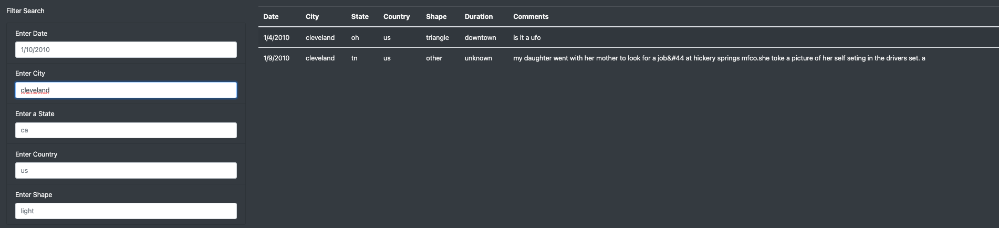
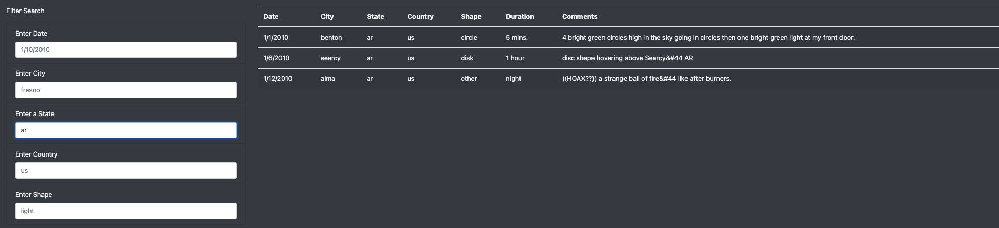
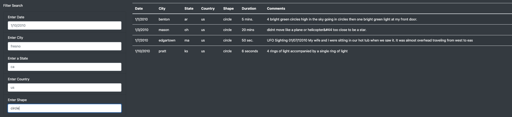

# UFOs

## Overview of Project:
This is a project created on JavaScript to reflect in a HTML page *The Truth is Out There*. Data base with sightings of UFO's spotted on US.
With a Filter Search that will slice the data filtering and grouping the results according to the input search.

## Results: 

### HTML Page

### Filter Criteria

### By Date

### By City

### By State

### By Shape

## Summary:

The project seems to be quite simple, but behind the scenes has a database in .Js, an App.js that holds the code. Index.html has the code that set up the visualization file, [Image, Filter Box, written information and data table].
Style.css holds the page customization components.